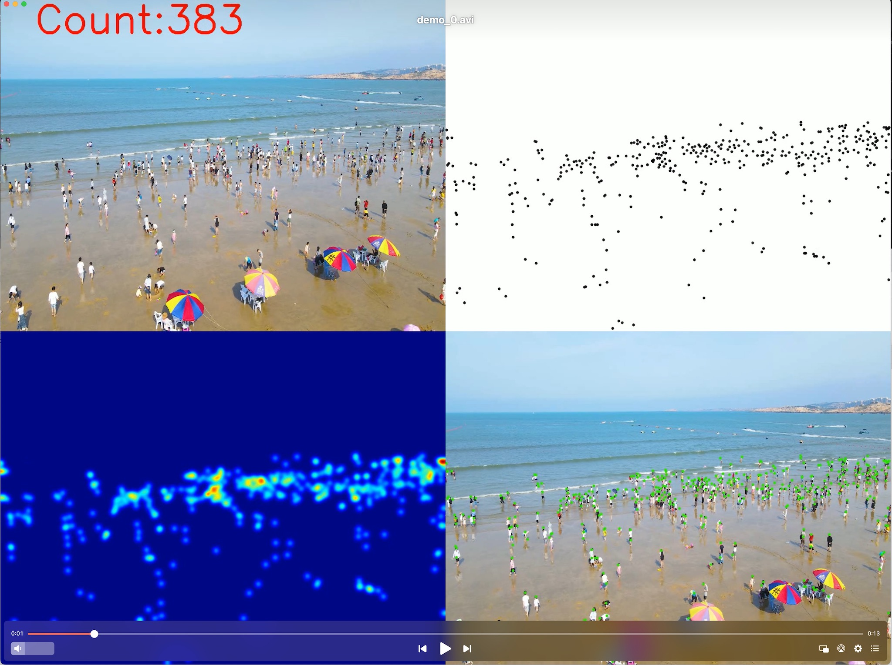

# CLTR (Crowd Localization TRansformer)

[[Project page](https://dk-liang.github.io/CLTR/)] [[paper](https://arxiv.org/abs/2202.13065)]

An official implementation of "An end to end transformer model for crowd localization" (Accepted by ECCV 2022). 

* *Currently, the code of this version is not well organized, which may contain some obscure code comments.*

# Environment
python ==3.6  
pytorch ==1.80  
opencv-python  
scipy   
h5py   
pillow  
imageio   
nni   
mmcv  
tensorboard  

# Datasets
- Download JHU-CROWD ++ dataset from [here](http://www.crowd-counting.com/)  
- Download NWPU-Crowd dataset (resized) from [here](https://pan.baidu.com/s/1aqiLFU6lo3F_HqeT6wbEjg), password: 04i4

# Prepare data
## Generate point map
```cd CLTR/data```  
For JHU-Crowd++ dataset: ```python prepare_jhu.py --data_path /xxx/xxx/jhu_crowd_v2.0```  
For NWPU-Crowd dataset: ```python prepare_nwpu.py --data_path /xxx/xxx/NWPU_CLTR```

## Generate image list
```cd CLTR```    
```python make_npydata.py --jhu_path /xxx/xxx/jhu_crowd_v2.0 --nwpu_path /xxx/xxx/NWPU_CLTR```

# Training 
Example (some hyper-parameters may be different from the original paper):  
```cd CLTR```  
```sh experiments/jhu.sh```   
or  
```sh experiments/nwpu.sh```   

* Please change ```nproc_per_node``` and ``` gpu_id``` of ```jhu.sh/nwpu.sh```, if you do not have enogh GPU. 
* We have fixed all random seeds, i.e., different runs will report the same results under the same setting.
* The model will be saved in ```CLTR/save_file/log_file```  
* Note that using FPN will improve the performance, but we do not add it in this version.  
* Turning some hyper-parameters will also bring improvement (e.g., the image size, crop size, number of queries).

Here we give the comparison.
| NWPU-Crowd (val set) | MAE | MSE |
| :-------------------- | :-------- | :----- |
| Original paper                   | 61.9   | 246.3     |
| This repo ([training log](./images/NWPU.log))                   | 51.3 | 116.7 |

# Testing
Example:  
```python test.py --dataset jhu --pre model.pth --gpu_id 2,3```   
or  
```python test.py --dataset nwpu --pre model.pth --gpu_id 0,1``` 

* The model.pth can be obtained from the training phase.

# Video Demo
Example:   
```python video_demo.py --video_path ./video_demo/demo.mp4 --num_queries 700 --pre video_model.pth```  

* The ```"video_model.pth"``` (trained from NWPU-Crowd training set) can be downloaded from [Baidu disk](https://pan.baidu.com/s/1ifubiFbj8u63pX3qt3F5rQ), password: rw6b or [Google drive](https://drive.google.com/file/d/1bccQIMeYBrEsgLAbWgxFE2sOsEhE2EKC/view?usp=sharing). 
* The generated video will be named ```"out_video.avi"```  

  

Visiting [bilibili](https://www.bilibili.com/video/BV1sS4y147YT/) or [Youtube](https://youtu.be/fqFNGMnveVQ) to watch the video demo. 

# Acknowledgement
Thanks for the following great work:
```
@inproceedings{carion2020end,
  title={End-to-end object detection with transformers},
  author={Carion, Nicolas and Massa, Francisco and Synnaeve, Gabriel and Usunier, Nicolas and Kirillov, Alexander and Zagoruyko, Sergey},
  booktitle={European conference on computer vision},
  pages={213--229},
  year={2020},
  organization={Springer}
}
```

```
@inproceedings{meng2021conditional,
  title={Conditional detr for fast training convergence},
  author={Meng, Depu and Chen, Xiaokang and Fan, Zejia and Zeng, Gang and Li, Houqiang and Yuan, Yuhui and Sun, Lei and Wang, Jingdong},
  booktitle={Proceedings of the IEEE/CVF International Conference on Computer Vision},
  pages={3651--3660},
  year={2021}
}
```
# Reference
If you find this project is useful, please cite:
```
@article{liang2022end,
  title={An end-to-end transformer model for crowd localization},
  author={Liang, Dingkang and Xu, Wei and Bai, Xiang},
  journal={European Conference on Computer Vision},
  year={2022}
}
```
